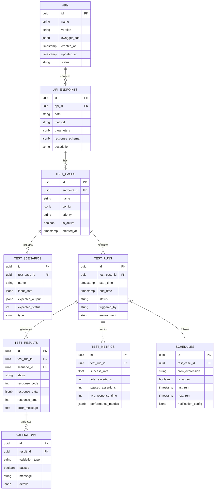

```mermaid
erDiagram
    APIs ||--o{ API_ENDPOINTS : contains
    API_ENDPOINTS ||--o{ TEST_CASES : has
    TEST_CASES ||--o{ TEST_SCENARIOS : includes
    TEST_CASES ||--o{ TEST_RUNS : executes
    TEST_RUNS ||--o{ TEST_RESULTS : generates
    TEST_RESULTS ||--o{ VALIDATIONS : validates
    TEST_RUNS ||--o{ TEST_METRICS : tracks
    TEST_RUNS }|--|| SCHEDULES : follows

    APIs {
        uuid id PK
        string name
        string version
        jsonb swagger_doc
        timestamp created_at
        timestamp updated_at
        string status
    }

    API_ENDPOINTS {
        uuid id PK
        uuid api_id FK
        string path
        string method
        jsonb parameters
        jsonb response_schema
        string description
    }

    TEST_CASES {
        uuid id PK
        uuid endpoint_id FK
        string name
        jsonb config
        string priority
        boolean is_active
        timestamp created_at
    }

    TEST_SCENARIOS {
        uuid id PK
        uuid test_case_id FK
        string name
        jsonb input_data
        jsonb expected_output
        int expected_status
        string type
    }

    TEST_RUNS {
        uuid id PK
        uuid test_case_id FK
        timestamp start_time
        timestamp end_time
        string status
        string triggered_by
        string environment
    }

    TEST_RESULTS {
        uuid id PK
        uuid test_run_id FK
        uuid scenario_id FK
        string status
        int response_code
        jsonb response_data
        int response_time
        text error_message
    }

    VALIDATIONS {
        uuid id PK
        uuid result_id FK
        string validation_type
        boolean passed
        string message
        jsonb details
    }

    TEST_METRICS {
        uuid id PK
        uuid test_run_id FK
        float success_rate
        int total_assertions
        int passed_assertions
        int avg_response_time
        jsonb performance_metrics
    }

    SCHEDULES {
        uuid id PK
        uuid test_case_id FK
        string cron_expression
        boolean is_active
        timestamp last_run
        timestamp next_run
        jsonb notification_config
    }
```
