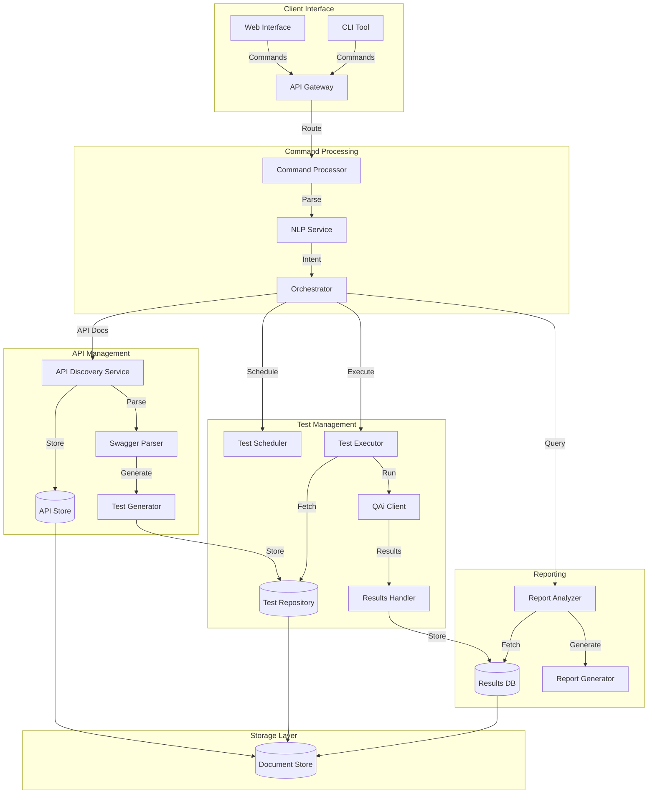

```mermaid
flowchart TD
    subgraph "Client Interface"
        UI[Web Interface]
        CLI[CLI Tool]
        UI & CLI -->|Commands| GW[API Gateway]
    end

    subgraph "Command Processing"
        GW -->|Route| CP[Command Processor]
        CP -->|Parse| NLP[NLP Service]
        NLP -->|Intent| OR[Orchestrator]
    end

    subgraph "API Management"
        OR -->|API Docs| AD[API Discovery Service]
        AD -->|Store| AS[(API Store)]
        AD -->|Parse| SP[Swagger Parser]
        SP -->|Generate| TG[Test Generator]
    end

    subgraph "Test Management"
        OR -->|Schedule| TS[Test Scheduler]
        OR -->|Execute| TE[Test Executor]
        TG -->|Store| TR[(Test Repository)]
        TE -->|Fetch| TR
        TE -->|Run| QA[QAi Client]
        QA -->|Results| RH[Results Handler]
    end

    subgraph "Reporting"
        RH -->|Store| RD[(Results DB)]
        OR -->|Query| RA[Report Analyzer]
        RA -->|Fetch| RD
        RA -->|Generate| RG[Report Generator]
    end

    subgraph "Storage Layer"
        AS --> DS[(Document Store)]
        TR --> DS
        RD --> DS
    end
```
